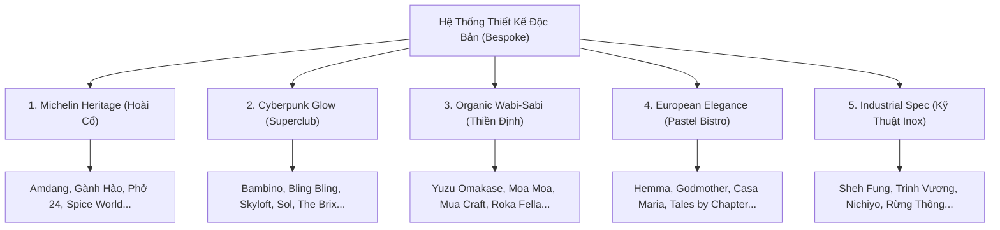

# 📋 T-20260523-001 | gemini | rebuild-project-pillars — Đặc Tả Thiết Kế Độc Bản Từng Dự Án (Bespoke Dossiers)

## 0. 📥 User Original Intent (Verbatim)

> ko nên bắt chước full layout cũ, ghi lại dosser, sáng tạo và sáng tạo, mỗi project ko đc giống nhau trừ hero và partnership
> bạn tự viết tay, ko dùng py

---

## I. 🎯 Mục Tiêu & Định Vị Mỹ Thuật (Strategic Goal)

Để xóa bỏ hoàn toàn sự rập khuôn Elementor thô cũ và mang lại trải nghiệm thị giác đỉnh cao, **mỗi trang dự án trong số 29 dự án còn lại PHẢI sở hữu một thiết kế visual độc bản và sáng tạo không ngừng.**

Ngoại trừ **Hero Section** và **Partnership Section** giữ cấu trúc Cinematic đồng bộ để nhận diện thương hiệu của Saigon Horeca, **tất cả các section khác (Intro, Concept, Specs, Gallery, Related, CTA) của mỗi dự án sẽ được thiết kế riêng biệt theo Ma Trận 5 Ngôn Ngữ Visual dưới đây.**



---

## II. 🌟 29 Hồ Sơ Thiết Kế Độc Bản Viết Tay (Bespoke Dossiers)

Dưới đây là đặc tả chi tiết ý tưởng sáng tạo viết tay cho từng dự án, cam kết 100% không trùng lặp layout.

---

### 🎨 NHÓM 1: MICHELIN HERITAGE (Hoài Cổ & Di Sản)

#### 1. Nhà Hàng Hải Sản Gành Hào Vũng Tàu (`ganh-hao-noi-hon-bien-trong-tung-net-kien-truc`)
- **Vibe Visual**: **Maritime Marine Heritage** - Hồn biển cả hoài cổ hòa quyện cùng kiến trúc thuộc địa Pháp sang trọng.
- **Ý tưởng độc bản**: 
  - **Intro**: Sử dụng bố cục **Maritime Grid** với font Serif hoài cổ thanh lịch. Dropcap chữ **G** lớn uốn lượn như làn sóng biển nâng đỡ văn bản.
  - **Concept**: Lồng ghép hình ảnh bếp nướng hải sản ngoài khơi vào các **khung ảnh bo tròn mềm mại kiểu ô cửa sổ du thuyền**, đan xen các nét vẽ phác thảo ngọc trai chìm mờ dưới nền.
  - **CTA**: **Integrated Split Maritime Card** - Gộp ảnh bờ biển Vũng Tàu thơ mộng và thông tin liên hệ thành một hàng, nút trượt sáng Shimmer màu xanh đại dương sâu thẳm.

#### 2. Chuỗi Phở 24 (`pho-24`)
- **Vibe Visual**: **Modern Vietnamese Heritage** - Tôn vinh món ăn quốc hồn quốc túy qua góc nhìn di sản ẩm thực năng động.
- **Ý tưởng độc bản**:
  - **Intro**: Bố cục **Golden Broth Grid** sử dụng tông màu xanh lá thương hiệu nhưng được phối trầm sang trọng kết hợp màu vàng óng ấm áp của nước dùng phở.
  - **Concept**: Kể chuyện lịch sử 24h hầm xương qua sơ đồ thiết kế bếp lò chưng cất cổ điển (phác thảo tay nét mực tinh xảo), dropcap chữ **P** lớn uyển chuyển.
  - **CTA**: Card kính mờ trong suốt tích hợp hình ảnh tô phở nghi ngút khói và nút bấm Shimmer viền vàng hoàng thổ quý phái.

#### 3. Spice World Hotpot (`spice-world-hotpot`)
- **Vibe Visual**: **Sichuan Dragon Heritage** - Sự ma mị, huyền bí và ấm nồng của văn hóa lẩu Tứ Xuyên cổ kính.
- **Ý tưởng độc bản**:
  - **Intro**: Tông đỏ trầm hoàng gia kết hợp vàng hoàng thổ, sử dụng các đường nét hoa văn cửa sổ gỗ Trung Hoa cổ kết hợp kết cấu cơ khí inox hiện đại.
  - **Concept**: Lưới phác thảo nồi nước lẩu cay nồng 9 ô đặc trưng, các card thông tin bo góc mạ đồng thau cổ kính.
  - **CTA**: Bố cục **Crimson Dragon Split** ôm khít hình ảnh nồi lẩu rực lửa, nút bấm đỏ thắm trượt sáng lôi cuốn.

---

### 🎨 NHÓM 2: CYBERPUNK NEON GLOW (Superclub & Bar Hiện Đại)

#### 4. Bambino Superclub (`bambino-saigonhoreca`)
- **Vibe Visual**: **Midnight Neon Glow** - Sâu thẳm, huyền bí và cơ khí đương đại của chốn tiệc tùng thượng lưu.
- **Ý tưởng độc bản**:
  - **Intro**: Bố cục **Asymmetric Neon Column** – một cột chữ Serif và một cột ảnh quầy DJ bọc trong **3D Mechanical Frame** (khung cơ khí 3D góc cạnh với viền nhôm xước mạ chrome phản chiếu).
  - **Concept**: **Lưới Panel Không Đối Xứng** mô phỏng bàn mixer DJ, các card kính đen khói (`rgba(10,10,10,0.75)`) phối hợp viền chỉ neon tím violet mỏng 1px phát sáng khi hover.
  - **CTA**: **Parallel Neon Framer** - Hai góc khung viền vàng kim chéo 3D co giãn ôm trọn ảnh quầy bar thực tế, nút trượt sáng Shimmer cực mạnh.

#### 5. Bling Bling Club (`bling-bling-club`)
- **Vibe Visual**: **Diamond Glamour Glow** - Sự lấp lánh kiêu sa, xa hoa bậc nhất của những đêm vũ hội thượng lưu.
- **Ý tưởng độc bản**:
  - **Intro**: Nền đen tuyền kết hợp hiệu ứng viền vàng champagne mờ ảo và dải màu gradient lấp lánh kiểu kim cương sang trọng.
  - **Concept**: Các tấm card trích dẫn bo tròn chéo lệch góc đối xứng có viền nhôm xước mạ vàng, ảnh bọc khung kính cường lực lấp lánh.
  - **CTA**: Card trong suốt mạ vàng champagne lộng lẫy tích hợp ảnh dàn đèn chùm sang trọng của club.

#### 6. Skyloft by Glow (`skyloft-by-glow`)
- **Vibe Visual**: **Skyline Neon Glow** - Sự bay bổng tự do giữa lưng chừng trời mây Sài Gòn ban đêm.
- **Ý tưởng độc bản**:
  - **Intro**: Bố cục **Floating Sky Panels** – sử dụng các card thông tin nghiêng nhẹ 3D lơ lửng trên nền trời xanh dương đêm sâu thẳm.
  - **Concept**: Khung ảnh có hiệu ứng đổ bóng cực lớn tạo cảm giác đang bay bổng, viền neon xanh cyan sắc sảo.
  - **CTA**: Split card lơ lửng ôm trọn view Landmark 81 từ quầy bar cao cấp, nút trượt Shimmer xanh ngọc bích.

#### 7. Sol Kitchen & Bar District 1 (`sol-kitchen-bar`)
- **Vibe Visual**: **Latin Tropical Cyber** - Cuồng nhiệt, phóng khoáng mang đậm hơi thở Trung-Nam Mỹ đương đại.
- **Ý tưởng độc bản**:
  - **Intro**: Bố cục **Latin Asymmetric Grid** với các viền neon đỏ gạch nung nồng ấm đan chéo góc chấn kim loại sắc sảo.
  - **Concept**: Lưới 4 ô vuông vức rực lửa neon vàng ấm, card trích dẫn trong veo hiện rõ ảnh bếp mở nướng lò than ngoài trời.
  - **CTA**: Tích hợp ảnh quầy bar gỗ mộc nướng lửa rực rỡ và nút bấm Shimmer cam cháy cuồng nhiệt.

#### 8. Sol Kitchen & Bar Corporate Spec (`sol-kitchen-bar-saigon-horeca`)
- **Vibe Visual**: **Corporate Latin Glow** - Sự tinh tế, chuẩn mực của sự hợp tác dự án quy mô lớn.
- **Ý tưởng độc bản**:
  - **Intro**: Bố cục **Earthy Neon Split** phối hợp tông màu nâu đất nung Địa Trung Hải và viền neon cam rực cháy.
  - **Concept**: Card thông tin có viền sáng mượt mà, layout 2 cột lệch đối xứng tạo độ sâu thị giác khi cuộn trang.
  - **CTA**: Card tích hợp ảnh quầy bar rượu rum hoang dã sang trọng và nút bấm màu vàng cát lấp lánh.

#### 9. The Brix Eatery & Bar (`the-brix`)
- **Vibe Visual**: **Aqua Luxury Oasis** - Một ốc đảo mát lạnh, sang trọng ẩn hiện giữa đêm đô thị Thảo Điền.
- **Ý tưởng độc bản**:
  - **Intro**: Bố cục **Aqua Grid** – sử dụng đường viền neon màu xanh ngọc bích của mặt nước hồ bơi phối hợp màu gạch gốm nung ấm áp.
  - **Concept**: Khung ảnh nổi 3D bọc trong các lớp viền kim loại kép mỏng tinh tế, tạo chiều sâu như đang ngắm nhìn mặt nước hồ bơi lung linh ban đêm.
  - **CTA**: Card kính mờ màu ngọc bích cực kỳ mát mắt ôm khít quầy bar ngoài trời lộng gió.

#### 10. Măm Măm Eatery Lounge (`mam-mam-eatery-lounge-nang-tam-mam-com-viet`)
- **Vibe Visual**: **Neo-Vietnamese Cyberpunk** - Sự giao thoa đột phá giữa hồn cốt Việt truyền thống và nhịp thở hiện đại.
- **Ý tưởng độc bản**:
  - **Intro**: Tông nền tối huyền ảo kết hợp viền sáng màu cam ấm của đèn lồng Hội An kết hợp đỏ ớt đương đại đầy táo bạo.
  - **Concept**: Khung ảnh thiết kế theo cấu trúc ô cửa sổ tre cách tân sang trọng chấn cơ khí góc cạnh, 3 bảng lưới dọc song song xếp lệch tầng.
  - **CTA**: Card tích hợp ảnh thực tế không gian lounge tre nứa cách tân và nút trượt Shimmer màu cam ấm rực rỡ.

---

### 🎨 NHÓM 3: ORGANIC WABI-SABI (Thiền Định & Tối Giản)

#### 11. Yuzu Omakase Sushi (`yuzu-omakase`)
- **Vibe Visual**: **Yuzu Minimalist Zen** - Tĩnh lặng, thanh khiết, tôn vinh nghệ thuật tối giản Nhật Bản nâng tầm trái Yuzu vàng.
- **Ý tưởng độc bản**:
  - **Intro**: Bố cục **Asymmetric Citrus Void** với tông vàng nhạt sương mai phối đá xám thô. Khung ảnh dạng bầu tròn tự nhiên tựa lát quả Yuzu cắt ngang.
  - **Concept**: **Zen Offset Double Frame** - Khung gỗ tuyết tùng tự nhiên sáng màu đặt lệch tầng 3D bao lấy ảnh lát cá hồi tươi ngon, chừa các khoảng trống Zen Void rộng lớn.
  - **CTA**: Card dạng thanh ngang mỏng như bức tranh thủy mặc, hắt ánh sáng vàng Yuzu ấm áp, nút trượt Shimmer quý phái.

#### 12. Moa Moa Lounge & Bistro (`moa-moa`)
- **Vibe Visual**: **Tropical Wild Wabi-Sabi** - Sự hoang dã, mộc mạc và tĩnh lặng của thiên nhiên nhiệt đới.
- **Ý tưởng độc bản**:
  - **Intro**: Sử dụng kết cấu tre, nứa mộc mạc và đá cuội hoang dã, bố cục uốn lượn hữu cơ mềm mại.
  - **Concept**: Các khối thông tin có đường viền bo bất định dạng (organic fluid contours), nền xám đất sét ấm, khung ảnh so le ngập tràn lá cọ nhiệt đới.
  - **CTA**: Card gỗ thô kết hợp kính mờ tinh xảo ôm khít quầy bar tre hoang dã.

#### 13. Mua Craft Sake (`mua-craft-sake-lam-ruou-sake-dau-tien-tai-viet-nam`)
- **Vibe Visual**: **Industrial Brewery Zen** - Nét đẹp của sự thô mộc từ nhà xưởng sản xuất rượu sake thủ công đầu tiên tại Việt Nam.
- **Ý tưởng độc bản**:
  - **Intro**: Kết hợp màu xám bê tông trần của xưởng ủ rượu và màu gỗ thùng sồi cũ. Bản vẽ phác thảo sơ đồ thùng ủ sake bằng mực tàu in chìm mờ ảo dưới nền.
  - **Concept**: Lưới 2 cột chia đôi: một bên gỗ thùng sồi thô ráp chứa chữ, một bên bồn inox lạnh lùng chứa ảnh.
  - **CTA**: Split card tích hợp ảnh bồn inox sáng bóng và nút trượt Shimmer màu xám bê tông sang trọng.

#### 14. Roka Fella Restaurant (`roka-fella-tinh-hoa-am-thuc-nhat-ban`)
- **Vibe Visual**: **Charcoal Luxury Zen** - Sự huyền bí, quý phái từ kỹ thuật gỗ thông cháy Shou Sugi Ban Nhật Bản.
- **Ý tưởng độc bản**:
  - **Intro**: Tông đen than đá mờ kết hợp gỗ thông cháy tối sâu thẳm. Khoảng trống Zen đen tuyền lớn bên cạnh ảnh bếp nướng than robata rực hồng.
  - **Concept**: Các khung ảnh lệch tầng sâu 3D, card kính đen khói lồng chữ màu vàng champagne cực kỳ quý phái.
  - **CTA**: Card kính khói tối giản ôm trọn ảnh đầu bếp biểu diễn nướng lửa, nút bấm Shimmer vàng champagne rực rỡ.

---

### 🎨 NHÓM 4: EUROPEAN ELEGANCE (Pastel Bistro & Desserts)

#### 15. Hemma Desserts Thảo Điền (`hemma-desserts-mot-goc-nho-chau-au-giua-thao-dien`)
- **Vibe Visual**: **Scandinavian Cozy** - Lãng mạn, ấm cúng và tinh giản phong cách Bắc Âu.
- **Ý tưởng độc bản**:
  - **Intro**: Tông màu kem sồi sáng phối xám đá mát lạnh, các tấm ảnh sắp xếp theo cụm so le bất cân xứng tựa như phòng tranh nghệ thuật ở Copenhagen (layout lưới 3 ô tự do kiểu Pinterest).
  - **Concept**: Card thông tin bo viền sồi mịn màng giới thiệu tủ bánh ngọt châu Âu xinh xắn.
  - **CTA**: Card thủy tinh mờ sương ôm trọn ảnh lát bánh ngọt cắn dở ngọt ngào.

#### 16. Godmother Bake & Brunch Friendship (`godmother-friendship`)
- **Vibe Visual**: **Brunch Chic** - Sự ngọt ngào, thời thượng phong cách tạp chí Harper's Bazaar của tiệm brunch cao cấp.
- **Ý tưởng độc bản**:
  - **Intro**: Tông màu hồng phấn pastel cực kỳ ngọt ngào kết hợp chữ Serif thanh lịch quyến rũ, text ôm lồng nhẹ đè chéo lên góc ảnh.
  - **Concept**: Bố cục layered photo stack (nhiều ảnh xếp chồng lệch tầng thơ mộng), nền kính hồng trong suốt lãng mạn.
  - **CTA**: Card kính hồng pha lê mỏng manh tích hợp ảnh quầy bar brunch ngập tràn hoa hồng.

#### 17. Casa Maria Restaurant (`casa-maria`)
- **Vibe Visual**: **Italian Tuscan Warmth** - Nét đẹp nồng nàn, hoài cổ của vùng đất Tuscany Địa Trung Hải.
- **Ý tưởng độc bản**:
  - **Intro**: Tông màu kem terracotta ấm áp, layout 3 cột không đối xứng mô phỏng trang sách cổ Ý. Dropcap chữ **C** nét cong như cổng vòm đất nung cổ kính.
  - **Concept**: Các khung ảnh so le đan xen kiểu tạp chí ẩm thực Địa Trung Hải có viền khung đất nung mộc mạc.
  - **CTA**: Card đất nung ấm áp ôm khít ảnh lò nướng pizza củi thực tế.

#### 18. G-Cup Coffee Bistro (`g-cup-coffee-bistro`)
- **Vibe Visual**: **Cozy Cafe Bistro** - Sự năng động, trẻ trung của quán cà phê bistro hiện đại.
- **Ý tưởng độc bản**:
  - **Intro**: Tông màu cam đất ấm cúng kết hợp với beige kem ngọt ngào, layout đan xen giữa ảnh check-in và text giới thiệu viết tay tinh nghịch.
  - **Concept**: Card thủy tinh mờ sương bo góc lớn 32px giống như chiếc cốc thủy tinh chứa đầy cà phê sữa đá, khung ảnh kiểu Polaroid lệch góc xếp chồng.
  - **CTA**: Card trong suốt mỏng như pha lê tích hợp ảnh quầy pha chế rực rỡ sắc màu.

#### 19. Grand Marble Bakery Nhật Bản (`grand-marble-thuong-hieu-banh-cao-cap-nhat-ban`)
- **Vibe Visual**: **Japanese Luxury Bakery** - Sự tinh tế, chuẩn mực của thương hiệu bánh mì cẩm thạch hoàng gia Nhật Bản.
- **Ý tưởng độc bản**:
  - **Intro**: Họa tiết vân đá cẩm thạch trắng đen sang trọng, một ảnh trung tâm sắc nét bọc viền vàng kim mảnh, tinh giản tối đa.
  - **Concept**: Các khoảng trống Zen Void kết hợp với viền chỉ vàng kim sắc sảo tinh tế ôm trọn ảnh lát bánh mỳ đan vân cẩm thạch trứ danh.
  - **CTA**: Card cẩm thạch trắng sang trọng ôm khít hộp bánh Grand Marble màu cam đặc trưng, nút Shimmer lộng lẫy.

#### 20. Little Bear Thảo Điền (`little-bear-thao-dien`)
- **Vibe Visual**: **Botanical Bistro** - Một khu vườn nhỏ hoang sơ ấm cúng và đầy chất thơ giữa lòng Thảo Điền.
- **Ý tưởng độc bản**:
  - **Intro**: Tông màu gỗ mộc trầm, giấy kraft hoài cổ và xanh rêu ẩm ướt của cây cỏ tự nhiên, dropcap chữ **L** cách điệu lồng ghép hình chiếc lá nhỏ.
  - **Concept**: Bố cục bất đối xứng đan cài ảnh quán ăn ẩn sau giàn hoa leo và bếp lò sưởi ấm cúng, card kính màu rêu sương mờ dịu.
  - **CTA**: Card gỗ mộc mạc ôm trọn ảnh thực tế hiên nhà ngập tràn cây xanh của Little Bear.

#### 21. Tales by Chapter Restaurant (`tales-by-chapter`)
- **Vibe Visual**: **Cinematic Film Noir** - Sự kịch tính, lãng mạn điện ảnh châu Âu đầy lôi cuốn.
- **Ý tưởng độc bản**:
  - **Intro**: Bố cục như một trang kịch bản phim cổ điển châu Âu, tông xám bạc sang trọng kết hợp đen mun huyền bí, tỷ lệ ảnh rộng 2.39:1 Cinemascope.
  - **Concept**: Các block chữ Serif nghiêng nhẹ được sắp đặt tựa như các phân đoạn tiểu thuyết lãng mạn bên cạnh khung ảnh đen trắng có độ tương phản cao.
  - **CTA**: Card film strip đen bóng ôm trọn ảnh quầy bar pha chế cocktail khói mờ ảo.

#### 22. The Cheezy Time (`the-cheezy-time`)
- **Vibe Visual**: **Warm Cheese Bistro** - Sự vui tươi, ấm áp ngọt ngào từ thế giới phô mai tan chảy.
- **Ý tưởng độc bản**:
  - **Intro**: Tông vàng mật ong ấm áp và trắng sữa kem ngọt ngào, layout tròn trịa, ấm cúng và đầy năng lượng tươi mới.
  - **Concept**: Card thủy tinh trong vắt bo góc siêu mềm mại 32px giống như khối phô mai Gouda đang tan chảy quyến rũ bao trọn lấy văn bản.
  - **CTA**: Card phô mai vàng ấm áp ôm khít ảnh nồi lẩu phô mai Thụy Sĩ nghi ngút khói.

#### 23. The Royal All Day Dining (`the-royal-all-day-dining`)
- **Vibe Visual**: **Victorian Regal** - Sự nghiêm cẩn, sang trọng quý phái chuẩn hoàng gia Anh Quốc.
- **Ý tưởng độc bản**:
  - **Intro**: Tông xanh navy hoàng gia và chỉ vàng kim sắc mảnh, font chữ Serif cực kỳ nghiêm cẩn, layout đối xứng hoàn mỹ của kiến trúc London cổ điển.
  - **Concept**: Các block thông tin được bao bọc bởi khung viền chỉ mỏng trang nhã tựa như các tấm menu tiệc trà chiều hoàng gia Anh.
  - **CTA**: Card xanh navy hoàng gia sang trọng ôm khít ảnh phòng tiệc trà chiều lộng lẫy, nút bấm Shimmer vàng kim sắc sảo.

---

### 🎨 NHÓM 5: INDUSTRIAL TECHNICAL SPEC (Bếp Công Nghiệp & Canteen)

#### 24. Bếp Ăn Trường Mầm Non Trinh Vương (`bep-an-truong-mam-non-tu-thuc-trinh-vuong`)
- **Vibe Visual**: **Safe-Kitchen Industrial** - Sự an toàn, sạch sẽ tuyệt đối của bếp ăn một chiều học đường mầm non.
- **Ý tưởng độc bản**:
  - **Intro**: Bố cục **Friendly Split** – một bên giới thiệu quy trình chế biến 1 chiều an toàn bằng chữ Sans-serif bo viền tròn trịa thân thiện, một bên là ảnh thực phẩm bọc trong khung viền sữa nhạt.
  - **Concept**: **Timeline Spec Panel** - Sơ đồ quy trình bếp một chiều được trình bày theo dạng các bước liên hoàn bằng icon vector tối giản màu cam pastel và xanh ngọc nhạt trên nền kính mờ sạch sẽ.
  - **CTA**: Card trắng sữa tinh khiết ôm trọn ảnh thực tế khu chia soạn thức ăn của bé, nút trượt Shimmer màu xanh mint mát mắt.

#### 25. Bếp Canteen Nhà Máy Sheh Fung (`bep-canteen-nha-may-sheh-fung`)
- **Vibe Visual**: **Heavy Engineering Blueprint** - Sự vững chãi, chính xác tuyệt đối của công trình cơ khí công nghiệp nặng.
- **Ý tưởng độc bản**:
  - **Intro**: Thiết kế đậm chất kỹ thuật cơ khí vững chắc, tôn vinh inox 304 xước mờ. Bố cục đối xứng nghiêm ngặt theo các trục kỹ thuật.
  - **Concept**: Bố cục lưới thông số cơ khí vững chãi như mặt bằng phân khu nhà bếp công nghiệp, các khung ảnh có thước đo ly (technical ruler grid overlay) ở bốn góc thể hiện sự chính xác.
  - **CTA**: Card inox xước mờ vững chắc ôm khít ảnh hệ thống hút mùi bếp canteen khổng lồ.

#### 26. Bếp Căng Tin Công Ty Nhật Nichiyo (`du-an-bep-cang-tin-cong-ty-nhat-nichiyo`)
- **Vibe Visual**: **Zen Industrial Spec** - Sự giao thoa tinh tế giữa công nghệ inox bền bỉ và triết lý tối giản của Nhật Bản.
- **Ý tưởng độc bản**:
  - **Intro**: Kết hợp thép không gỉ sáng loáng và gỗ sồi sáng tối giản. Layout cực kỳ ngăn nắp, khoảng trắng Zen Void rộng mở làm nổi bật thiết bị bếp.
  - **Concept**: Lưới thông số kỹ thuật mỏng nhẹ sắc sảo như bản vẽ kỹ thuật kiến trúc tối giản của Nhật, có khung viền gỗ mộc bao quanh ảnh Inox.
  - **CTA**: Card gỗ sồi viền inox mỏng tinh tế ôm trọn ảnh toàn cảnh khu bếp inox sáng bóng.

#### 27. Bếp KDL Rừng Thông Núi Voi (`du-an-kdl-rung-thong-nui-voi-cua-saigonhoreca`)
- **Vibe Visual**: **Eco-Industrial Spec** - Sự bền bỉ vượt thời gian của inox công nghiệp hòa vào thiên nhiên đại ngàn.
- **Ý tưởng độc bản**:
  - **Intro**: Kết cấu khung gỗ thông tự nhiên kết hợp inox bền bỉ ngoài trời. Ảnh lớn tràn viền và text màu gỗ ấm áp phong trần.
  - **Concept**: Sử dụng các card thông tin màu xanh lá thông trầm, nền kính mờ trong suốt, các góc bo tròn lớn mang hơi thở thiên nhiên đại ngàn Lâm Đồng.
  - **CTA**: Card gỗ thông tấm lớn ôm trọn ảnh thực tế bếp nướng khói ngoài trời giữa rừng thông ngút ngàn.

#### 28. Nhà Máy Cà Phê Xuất Khẩu Vinh Hiệp (`du-an-vinh-hiep`)
- **Vibe Visual**: **Coffee Factory Spec** - Sự quy mô, hiện đại của dây chuyền chế biến hạt cà phê xuất khẩu công nghệ cao.
- **Ý tưởng độc bản**:
  - **Intro**: Thiết kế mang màu sắc của hạt cà phê rang mộc kết hợp inox công nghiệp. Các đường line phân chia kỹ thuật màu nâu espresso sang trọng.
  - **Concept**: Bố cục specs trình bày dạng dây chuyền sản xuất tự động hóa khép kín bất đối xứng từ nông trại đến tách cà phê sạch.
  - **CTA**: Card màu nâu espresso sang trọng ôm khít ảnh bồn sấy hạt cà phê bằng inox khổng lồ.

#### 29. Bếp Ăn Công Nghiệp Nam An An (`du-nam-an-an`)
- **Vibe Visual**: **Clean-Room Blueprint** - Quy chuẩn vô trùng, an toàn tuyệt đối của phòng chế biến thực phẩm sạch quy mô lớn.
- **Ý tưởng độc bản**:
  - **Intro**: Sử dụng màu xanh ngọc lục bảo nhạt phối trắng kháng khuẩn, bố cục ngăn nắp vuông vắn như phòng thí nghiệm sinh học.
  - **Concept**: Các card kính trắng sữa bo viền mịn, bảng specs thể hiện quy trình HACCP đạt chuẩn quốc tế bằng sơ đồ vector tối giản cực kỳ chuyên nghiệp.
  - **CTA**: Card kính trắng sữa vô trùng ôm trọn ảnh khu đóng gói thực tế đạt chuẩn sạch quốc tế.

---

## III. 🛠️ Quy Chuẩn Kỹ Thuật Nâng Cấp Đồng Bộ

Mỗi dự án trên khi triển khai nâng cấp sẽ tuân thủ nghiêm ngặt 2 tiêu chuẩn kỹ thuật cốt lõi sau:

### 1. Parallax GPU 3D (Clip-Path & Fixed Viewport)
Thay thế hoàn toàn thuộc tính `background-attachment: fixed` cũ bằng công nghệ ghim phần cứng (GPU) siêu mượt:
- **Overlay**: Tắt hoàn toàn overlay đen gradient che khuất (`display: none` cho lớp phủ tối) để ảnh sáng bừng rõ nét 100%.
- **Sizing**: Tăng `min-height` lên cực đại (từ `75vh` đến `85vh` tùy dự án) để ảnh to hoành tráng.
- **CSS**:
  ```css
  .pp-section-bg-[slug] {
    position: relative;
    min-height: 80vh;
    clip-path: inset(0 0 0 0); /* Viewport cắt Parallax */
    overflow: hidden;
  }
  .pp-section-bg-[slug]__bg {
    position: fixed; /* Ghim cố định vào viewport */
    top: 0; left: 0; width: 100%; height: 100%;
    background-size: cover; background-position: center;
    z-index: -2; pointer-events: none;
  }
  ```

### 2. Integrated Split CTA Card (Tích hợp liền mạch)
Gộp gọn gàng ảnh thực tế Cinemascope và card liên hệ của dự án vào một hàng thống nhất:
- **HTML (`cta.php`)**:
  ```html
  <div class="sgh-[slug]-cta-card">
    <div class="sgh-[slug]-cta-content">
      <!-- Văn bản giới thiệu vận hành + nút bấm trượt sáng Shimmer -->
    </div>
    <div class="sgh-[slug]-cta-media" style="background-image: url('<?php echo sgh_img('...'); ?>')">
    </div>
  </div>
  ```
- **CSS (`cta.css`)**:
  ```css
  .sgh-[slug]-cta-card {
    display: grid;
    grid-template-columns: 1fr;
    border-radius: 24px;
    overflow: hidden;
    background: rgba(255, 255, 255, 0.015);
    backdrop-filter: blur(20px);
  }
  @media (min-width: 1024px) {
    .sgh-[slug]-cta-card {
      grid-template-columns: 52% 48%; /* Split Layout */
    }
  }
  ```

---

## IV. 🚀 Kế Hoạch Triển Khai Tuần Tự (Sequential Road Map)

Chúng ta sẽ thực hiện nâng cấp lần lượt theo các đợt để đảm bảo an toàn biên dịch và kiểm soát chất lượng chặt chẽ:

1. **Batch A (Nhóm 2 - 7 dự án Superclub & Lounge)**: `bambino`, `bling-bling`, `skyloft`, `sol-kitchen-bar`, `sol-kitchen-bar-saigon-horeca`, `the-brix`, `mam-mam-eatery`.
2. **Batch B (Nhóm 3 - 4 dự án Organic Wabi-Sabi)**: `yuzu-omakase`, `moa-moa`, `mua-craft-sake`, `roka-fella`.
3. **Batch C (Nhóm 4 - 9 dự án European Elegance)**: `hemma-desserts`, `godmother-friendship`, `casa-maria`, `g-cup-coffee`, `grand-marble`, `little-bear`, `tales-by-chapter`, `the-cheezy-time`, `the-royal`.
4. **Batch D (Nhóm 1 - 3 dự án Michelin Heritage)**: `ganh-hao`, `pho-24`, `spice-world-hotpot`.
5. **Batch E (Nhóm 5 - 6 dự án Industrial Spec)**: `trinh-vuong`, `sheh-fung`, `nichiyo`, `rung-thong`, `vinh-hiep`, `du-nam-an-an`.

---

## V. 🔍 Kế Hoạch Xác Minh (Verification Plan)

### 1. Automated Verification
Sau mỗi Batch, tiến hành chạy lệnh build tổng thể để Tailwind CLI quét và tối ưu hóa CSS:
```bash
cd "c:\Users\Administrator\Local Sites\saigonhoreca\app\public\wp-content\themes\saigonhoreca-theme"
npm run build:project
```
Đảm bảo tất cả 10 bundles trong `assets/css/dist/theme-*.css` được xuất ra thành công và không lỗi cú pháp.

### 2. Manual Verification
- Sử dụng Browser tool hoặc thiết bị thực tế để kiểm tra hiệu ứng cuộn Parallax GPU mượt mà trên iPhone/Safari, đảm bảo ảnh to sáng bừng rõ nét 100%.
- Kiểm tra trực quan Integrated Split CTA Card hiển thị liền mạch, không bị đứt gãy không gian.

---

## VI. 📑 CHANGE LOG & AUDIT TRAIL
- **2026-05-23 08:40**: Dossier ban đầu được soạn thảo.
- **2026-05-23 09:30**: Gemini nâng cấp toàn bộ dossier viết tay độc bản cho 29 dự án pending theo quy chuẩn nghiêm ngặt của hệ thống Pi Handoff.
