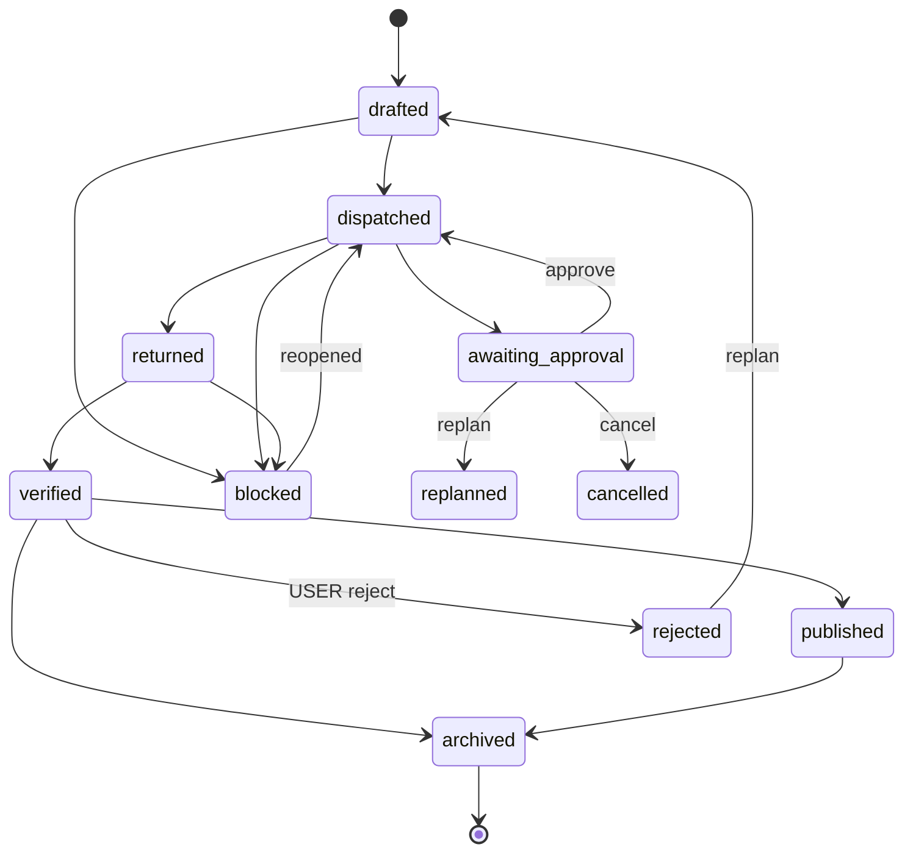

# Task Lifecycle — State Machine — v1.5

> **Reconstructed: 2026-06-03** (file đã bị NULL — rebuild theo `set-state.sh` + `PI-CONTENT-ENGINES.md §II`, house style giữ nguyên).
> **1 nhà cho STATE MACHINE** của task. HITL **không** ở đây nữa — đã tách sang [`HITL.md`](HITL.md) (v1.5). File này chỉ giữ tham chiếu state `awaiting_approval`.
> Liên hệ: phases ở [`WORKFLOW.md`](WORKFLOW.md) · gates ở [`QUALITY-GATES.md`](QUALITY-GATES.md) · evidence ở [`REPORTING.md`](REPORTING.md) · đọc-gì-khi-nào ở [`READ-CHAINS.md`](READ-CHAINS.md).

---

## 0. Mô hình actor / Actor Model

3 actor vận hành state machine. Phân biệt rạch ròi ai được phép gây transition nào:

| Actor | Là gì | Quyền transition |
|---|---|---|
| 👤 **USER** | Runtime orchestrator (con người ra quyết định cuối) | approve/replan/cancel ở HITL; final signoff `verified→published`; quyết `rejected` |
| 🤖 **AGENT** | Orchestrator (Tier 1) hoặc Worker (Tier 2) | Orchestrator: `drafted→dispatched`, `returned→verified`, archive. Worker: `dispatched→returned`, raise `blocked`/`awaiting_approval` |
| ⚙️ **SCRIPT** | `set-state.sh` / `archive-task.sh` / `reconcile.sh` | Thực thi transition atomic + sync STATUS.md + log §XVI. KHÔNG tự quyết — chỉ enforce machine đã hợp lệ |

**Quy tắc vàng**: AGENT đề xuất, SCRIPT enforce, USER quyết các transition có rủi ro (HITL · published · rejected). Worker **không bao giờ** tự set `verified`/`published`/`archived`.

---

## 0.5 Master lifecycle (tổng quan)

> Chuỗi chính: `drafted → dispatched → returned → verified → published|archived`.
> Nhánh: `blocked`, `awaiting_approval`, `rejected`, `replanned`, `cancelled`.

---

## IX. HITL (đã chuyển nhà → `HITL.md`)

> ⚠️ **Cơ chế HITL KHÔNG còn ở đây.** Đã consolidate sang [`HITL.md`](HITL.md) (v1.5) — 1 nhà cho trigger · dossier fields · flow · default-safe. KHÔNG duplicate.

Trong state machine, HITL chỉ tồn tại dưới dạng **1 state**: `awaiting_approval`.

- Worker `pause` + ghi `state: awaiting_approval` khi gặp trigger (confidence < threshold, action ∈ `hitl_triggers`, `risk: critical` chưa approve, `pause_after_phase`).
- USER quyết: **approve** → quay `dispatched` (resume) · **replan** → `replanned` · **cancel** → `cancelled`.
- Còn `awaiting_approval` chưa resolve = **chặn `verified`** (HITL Gate, [`QUALITY-GATES.md`](QUALITY-GATES.md)).

→ Chi tiết đầy đủ: đọc [`HITL.md`](HITL.md). Đây chỉ là con trỏ.

---

## X. State Table

Mỗi state: nghĩa · điều kiện vào · actor được phép set · cách set.

| State | Nghĩa | Điều kiện vào | Set bởi | Cách set |
|---|---|---|---|---|
| `drafted` | Dossier tạo từ template, chưa dispatch | `new-task.sh` xong, §II–IX điền | AGENT (orchestrator) | `new-task.sh` (initial) |
| `dispatched` | Đã giao worker, đang thực thi | Worker nhận prompt + lock acquired | AGENT (orchestrator) | `set-state.sh <ID> dispatched` |
| `returned` | Worker xong, đã nộp evidence | REPORT block / `returns/<ID>-return.md` có | AGENT (worker) | `set-state.sh <ID> returned` |
| `verified` | 4 gates pass + HITL resolved | ALL gate `pass` + raw evidence audited | AGENT (orchestrator) | `set-state.sh <ID> verified` |
| `published` | Đã ship (WP post / upload / commit lên prod) | Có link/ack; `requires_user_approval` resolved | 👤 USER + AGENT | manual / `archive-task.sh` flow |
| `archived` | Terminal — đã ship + thu kết quả | Đã verified/published + LEADERBOARD ghi | ⚙️ SCRIPT | `archive-task.sh <ID>` |
| `blocked` | Stuck (gate fail / thiếu input) | Lý do ghi §XV Escalation | AGENT | `set-state.sh <ID> blocked --reason "..."` |
| `awaiting_approval` | Chờ USER duyệt (HITL) | Trigger HITL (xem [`HITL.md`](HITL.md)) | AGENT (worker) | `set-state.sh`* / manual (xem ghi chú §X.1) |
| `rejected` | USER từ chối kết quả verified | USER signoff = reject | 👤 USER | manual + log §XIV/§XVI |
| `replanned` | Cần rescope, quay về drafting | replan từ HITL/reject | AGENT (orchestrator) | manual + log §XVI |
| `cancelled` | Bỏ task (terminal) | USER cancel | 👤 USER | manual + log §XVI |

> ⚙️ **Nguồn sự thật của transition hợp lệ = `system/scripts/set-state.sh`.** Regex script chỉ accept: `drafted|dispatched|returned|verified|blocked|reopened`. Các state nhánh khác (`awaiting_approval`, `rejected`, `replanned`, `cancelled`, `published`) set bằng `archive-task.sh` flow hoặc manual edit + log §XVI — KHÔNG qua regex của `set-state.sh`.

### X.1 State-Transition Matrix (khớp `set-state.sh`)

Bảng dưới = **bản sao 1:1** của `declare -A VALID` trong `set-state.sh`. Mọi transition nằm trong machine này được SCRIPT enforce; phần còn lại là manual/archive-flow.

| Từ \ Đến | dispatched | returned | verified | blocked | reopened |
|---|:---:|:---:|:---:|:---:|:---:|
| **drafted** | ✅ | | | ✅ | |
| **dispatched** | | ✅ | | ✅ | |
| **returned** | | | ✅ | ✅ | |
| **verified** | | | | ✅ | |
| **blocked** | | | | | ✅ |
| **reopened** | ✅ | ✅ | | | |

> `reopened` = pseudo-state dùng để thoát `blocked` (Phase E rollback < 1h, xem [`WORKFLOW.md`](WORKFLOW.md) §2.5). Sau `reopened` quay lại `dispatched`/`returned` tùy chỗ đang dở.
> `verified → archived` **KHÔNG** qua `set-state.sh` — dùng `archive-task.sh` (atomic Phase D).
> Các transition nhánh HITL/USER (`→ awaiting_approval`, `→ rejected`, `→ replanned`, `→ cancelled`) nằm ngoài regex `set-state.sh` (xem §X note + [`HITL.md`](HITL.md)).

### X.2 Quy tắc chung

1. **Chỉ tiến 1 bước** theo chuỗi chính — không nhảy cóc.
2. **`blocked` vào được từ bất kỳ active state** (`drafted`/`dispatched`/`returned`/`verified`), phải ghi lý do §XV.
3. **Thoát `blocked`** qua `reopened` → quay đúng state đang dở.
4. **Mọi transition log §XVI Change Log** của dossier (timestamp + from→to + reason) — `set-state.sh` tự append.
5. **Worker không tự duyệt mình**: `returned→verified` chỉ orchestrator; `→archived` chỉ SCRIPT.

---

## XI. Liên kết / See also
[`WORKFLOW.md`](WORKFLOW.md) (7 phases) · [`QUALITY-GATES.md`](QUALITY-GATES.md) (4+HITL gate) · [`REPORTING.md`](REPORTING.md) (evidence) · [`HITL.md`](HITL.md) (HITL 1-nhà) · [`READ-CHAINS.md`](READ-CHAINS.md) · `scripts/set-state.sh` (enforcer).

## Changelog
- **v1.5** (reconstructed 2026-06-03) — Rebuild sau NULL corruption. §IX trỏ về `HITL.md` (HITL đã tách nhà, no duplicate). §X State Table + §X.1 Matrix khớp `set-state.sh` regex (`drafted|dispatched|returned|verified|blocked|reopened`). Thêm §0 actor model (USER/AGENT/SCRIPT).
