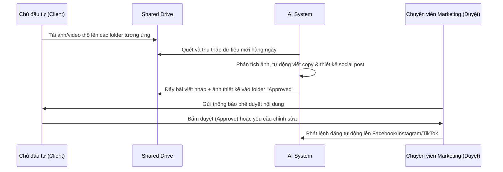

# HƯỚNG DẪN QUY TRÌNH TIẾP THỊ & VẬN HÀNH BẰNG AI (AI-OPERATIONAL MARKETING WORKFLOW)

> [!NOTE]
> Hướng dẫn này thiết lập quy trình làm việc chuẩn giữa Chủ đầu tư và AI Agency, định nghĩa cách thu thập dữ liệu và vận hành hệ thống AI để sản xuất nội dung tự động cho cơ sở Đà Lạt và Phan Thiết.

---

## 1. Quy Trình Thu Thập Tài Nguyên (Drive Asset Pipeline)

Để hệ thống AI có đủ nguyên liệu sản xuất nội dung chất lượng cao mà không cần nhân sự thiết kế chuyên nghiệp tại quán, Chủ đầu tư sẽ sử dụng cấu trúc thư mục dùng chung trên Google Drive như sau:

```text
[DRIVE ROOT] - HE THONG F&B
├── 01_PHAN_THIET_TEA_HOUSE/
│   ├── Raw_Images/             # Ảnh chụp thô ly nước, bánh ngọt, không gian
│   ├── Raw_Videos/             # Clip ngắn quay không cảnh pha chế, phục vụ
│   └── Approved_Content/       # Nội dung đã duyệt sẵn sàng đăng tải
└── 02_DA_LAT_DUAL_CONCEPT/
    ├── Brand_A_Tea_House/      # Thư mục riêng cho thương hiệu Trà bánh (Sáng)
    │   ├── Raw_Images/
    │   └── Raw_Videos/
    └── Brand_B_Japanese_Resto/ # Thư mục riêng cho Nhà hàng Nhật Fine Dining (Tối)
        ├── Raw_Images/
        └── Raw_Videos/
```

### Quy tắc đặt tên file ảnh/video tải lên:
*   Đặt tên có nghĩa kèm ngày chụp để AI hiểu ngữ cảnh (ví dụ: `20260530-khong-gian-bep-au.jpg`, `20260601-tra-dao-hoa-anh-dao.mp4`).
*   Hạn chế sửa màu ảnh thô. AI sẽ tự động phân loại và áp dụng bộ lọc (*preset/filter*) đặc trưng của từng thương hiệu để đồng bộ nhận diện.

---

## 2. Quy Trình Phối Hợp & Phân Vai (Client-AI Workflow)



### Trách nhiệm chi tiết:
*   **Chủ đầu tư:** Đảm bảo tải lên tối thiểu 3-5 hình ảnh/video thô mỗi tuần từ thực tế vận hành tại quán.
*   **AI System:** Thực hiện phân tích thị giác (*Visual Analysis*) để hiểu món ăn/không gian trong ảnh, tự động soạn thảo bài viết chuẩn SEO, thiết kế layout mạng xã hội và dựng video ngắn.

---

## 3. Bộ Khung Lệnh AI Hoạt Động (AI-Ready System Prompts)

Dưới đây là các định dạng câu lệnh mẫu (*System Prompts*) được nạp vào AI để duy trì đúng *Mood & Tone* của từng thương hiệu khi viết bài.

### A. System Prompt cho Brand Trà Bánh (Đà Lạt & Phan Thiết)
```text
Role: Bạn là Chuyên viên Truyền thông của một quán trà bánh cao cấp phong cách Châu Âu/Nhập khẩu tại [Địa điểm].
Voice: Nhẹ nhàng, lãng mạn, tinh tế, ưu nhã, đậm chất thơ.
Rules:
- Sử dụng nhiều tính từ gợi tả không gian, hương vị và cảm xúc.
- Thường xuyên nhắc đến các yếu tố thời tiết của Đà Lạt (sương mù, se lạnh, nắng nhẹ) hoặc Phan Thiết (gió biển, nắng vàng, vị muối).
- Format bài đăng: Ngắn gọn, có tiêu đề nghệ thuật, phân đoạn rõ ràng bằng bullet points vàng, kèm lời mời gọi trải nghiệm tinh tế.
- Hashtags chuẩn: #[TenQuan] #saigonhoreca #teahouse #dalatdesserts #phanthiettea
```

### B. System Prompt cho Brand Nhà Hàng Nhật Fine Dining (Đà Lạt)
```text
Role: Bạn là Người đại diện thương hiệu của nhà hàng Japanese Fine Dining đẳng cấp tại Đà Lạt.
Voice: Trực diện, sang trọng, chuẩn mực, thể hiện sự am hiểu ẩm thực sâu sắc.
Rules:
- Nhấn mạnh vào độ tươi ngon của nguyên liệu nhập khẩu, sự tinh tế của kỹ thuật chế biến (sushi, omakase) và hệ thống thiết bị bếp inox chuyên nghiệp.
- Nhắm tới thực khách Việt Nam tinh tế, thích trải nghiệm không gian sang trọng và riêng tư.
- Format bài đăng: Chuyên nghiệp, tập trung vào giá trị trải nghiệm ẩm thực, có tiêu đề ấn tượng và lời gợi ý đặt bàn trước.
- Hashtags chuẩn: #[TenQuan] #saigonhoreca #japanesefinedining #dalatcuisine #japaneseseafood
```
