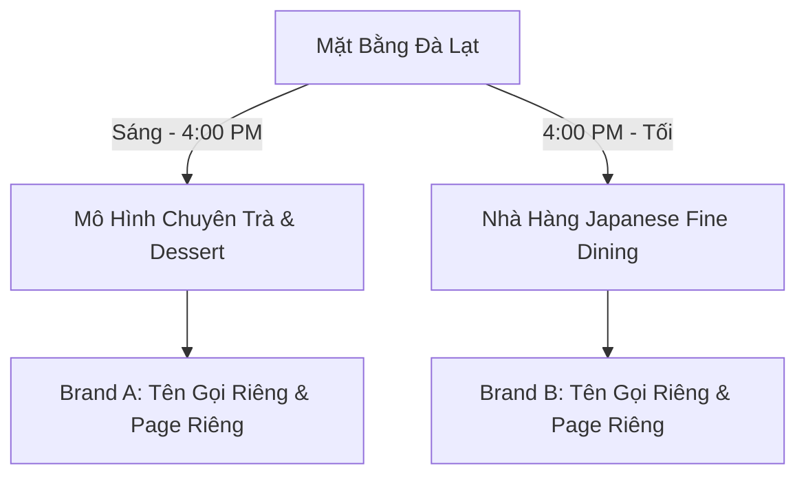

# TÓM TẮT Ý TƯỞNG SÁNG TẠO & ĐỊNH VỊ THƯƠNG HIỆU (BRAND CONCEPT BRIEF)

> [!NOTE]
> Tài liệu này phác thảo định hướng định vị thương hiệu (*Branding*), triết lý thiết kế và chiến lược phân khúc khách hàng cho hệ thống cơ sở Đà Lạt và Phan Thiết. Đây là cẩm nang định hướng cho đội ngũ sáng tạo nội dung, thiết kế giao diện và vận hành AI.

---

## 1. Cơ Sở Đà Lạt (Mô Hình Dual-Concept)

Cơ sở Đà Lạt đại diện cho một thử nghiệm kinh doanh đột phá: tận dụng tối đa giá trị mặt bằng bằng cách chia đôi ngày vận hành cho hai nhóm dịch vụ khác biệt về sản phẩm, đối tượng phục vụ và trải nghiệm không gian.

### A. Concept Ban Ngày: Trà Nhập Khẩu & Bánh Ngọt (Đến 4:00 PM)
*   **Giá trị cốt lõi:** Sự thư thái, thanh nhã và tận hưởng. Trọng tâm là nghệ thuật thưởng trà hiện đại với các loại trà nhập khẩu cao cấp kết hợp bánh ngọt và các món tráng miệng ngọt (*desserts*) làm từ trà.
*   **Trải nghiệm không gian:** Tận dụng ánh sáng tự nhiên của Đà Lạt, âm nhạc nhẹ nhàng, cách bài trí mang tính nghệ thuật cao.
*   **Tệp khách hàng mục tiêu (*Target Audience*):** Giới trẻ du lịch, các cặp đôi, người yêu thích thiết kế nghệ thuật, khách hàng tìm kiếm địa điểm check-in sang trọng và yên bình.
*   **Tên gọi gợi ý định hướng:** Cần mang tính thơ mộng, nhẹ nhàng, thiên về trải nghiệm (ví dụ: liên quan đến sương mù, lá trà, thảo mộc nhập khẩu).

### B. Concept Ban Đêm: Nhà Hàng Japanese Fine Dining (Từ 4:00 PM trở đi)
*   **Giá trị cốt lõi:** Sự tinh tế, chuẩn mực và trải nghiệm ẩm thực đỉnh cao. Phục vụ món ăn Nhật Bản được tinh chỉnh để hợp khẩu vị và thị hiếu người Việt nhưng vẫn giữ trọn vẹn tinh hoa chế biến kiểu Nhật.
*   **Trải nghiệm không gian:** Ánh sáng ấm cúng, sang trọng, mang tính riêng tư cao. Quầy bar bếp nóng/lạnh inox 304 cao cấp (do Saigon Horeca thiết kế và thi công) trở thành sân khấu trình diễn của các đầu bếp.
*   **Tệp khách hàng mục tiêu (*Target Audience*):** Gia đình thượng lưu, nhóm đối tác bàn công việc, giới sành ăn (*foodies*), khách hàng tổ chức tiệc kỷ niệm/tiệc tối cao cấp.
*   **Tên gọi gợi ý định hướng:** Mang tính mạnh mẽ, khẳng định đẳng cấp, mang đậm phong vị Nhật Bản cổ điển kết hợp hiện đại.

### C. Chiến lược Vận hành Thương hiệu độc lập (Brand Split)
*   **Tại sao cần tách biệt tên gọi và trang mạng xã hội?**
    1.  *Tránh xung đột nhận diện:* Khách hàng đi uống trà bánh lãng mạn ban ngày sẽ bối rối nếu thấy trang mạng xã hội ngập tràn hình ảnh sashimi hay bếp nóng khói nghi ngút, và ngược lại.
    2.  *Tối ưu hóa phễu quảng cáo:* Giúp AI và đội ngũ tiếp thị nhắm mục tiêu chính xác tệp khách hàng cho từng khung giờ, tối ưu chi phí quảng cáo.
    3.  *Xây dựng hai câu chuyện riêng biệt:* Tăng tính độc bản và giá trị thương hiệu tự thân của mỗi thương hiệu.

---

## 2. Cơ Sở Phan Thiết (Mô Hình Chuyên Trà & Dessert Cả Ngày)

*   **Giá trị cốt lõi:** Trải nghiệm thư giãn ven biển, không gian tụ họp bạn bè bên những tách trà mát lạnh và bánh ngọt cao cấp. Vận hành xuyên suốt cả ngày để đón dòng khách du lịch và địa phương liên tục.
*   **Concept hình ảnh:** Sử dụng các tông màu sáng, kết hợp gỗ và kính, tạo cảm giác rộng mở, thoáng đãng như gió biển.
*   **Tệp khách hàng mục tiêu (*Target Audience*):** Khách du lịch đến Phan Thiết, người dân địa phương tìm kiếm không gian làm việc hoặc gặp gỡ hiện đại, giới trẻ yêu thích bánh ngọt và trà pha chế nghệ thuật.
*   **Định hướng phát triển nội dung:** Kế thừa từ các tài khoản mạng xã hội sẵn có, tập trung vào hình ảnh sản phẩm mát lạnh, các món tráng miệng bắt mắt và góc chụp không gian lộng gió.
